  

  

 

  
  &nbsp;
  
  &nbsp;
  

 

## 👨‍💻 About Me

I'm Peter 👋 a passionate Cloud/DevOps engineer with a strong background in cloud technologies and automation. I enjoy building scalable and resilient systems that empower teams to deliver software faster and more efficiently. Here you'll find some of my projects, contributions, and open-source work.

**🔧 Technologies and Tools**
- **Cloud:** AWS, Azure, GCP
- **Containerization:** Docker, Kubernetes, ECS, EKS
- **CI/CD:** Jenkins, GitHub Actions, CircleCI, Argo CD
- **Config Management:** Ansible
- **IaC:** Terraform, CloudFormation, Helm
- **Monitoring:** Prometheus, Grafana, ELK Stack, CloudWatch, NewRelic
- **Scripting:** Bash, Python, Go
- **Programming:** TypeScript
- **Version Control:** Git, GitHub, GitLab
- **Security:** AWS Secrets Manager, IAM, RBAC, Network Policies, External Secrets Operator

📫 How to reach me: [peteolay@previselab.com](mailto:peteolay@previselab.com)

 

## Tech Stack

  
   
  
   
  

 

## Projects

| | |
|---|---|
| **[Deployment-of-Super-Mario-on-Kubernetes-using-Terraform](https://github.com/PetersonOlay/Deployment-of-Super-Mario-on-Kubernetes-using-Terraform)** &nbsp;   Deploy Super Mario on Amazon EKS using Terraform — end-to-end Kubernetes orchestration and AWS infrastructure provisioning. | **[terraform-project-portfolio](https://github.com/PetersonOlay/terraform_project_portfolio)** &nbsp;   Modular Terraform IaC for provisioning multi-AZ AWS environments — VPC, EKS, RDS, IAM, all version-controlled and repeatable. |
| **[CICD-Project](https://github.com/PetersonOlay/CICD_Project)** &nbsp;   Automates AWS Lambda deployments via GitHub Actions — push to main, function ships. | **[Previselab-ResumeApp](https://github.com/PetersonOlay/Previselab_ResumeApp)** &nbsp;   CI/CD pipeline that auto-deploys a live resume on every commit — HTML → S3 → CloudFront, zero manual steps. |

 

## GitHub Stats

  <picture>
    <source media="(prefers-color-scheme: dark)" srcset="https://github-readme-activity-graph.vercel.app/graph?username=PetersonOlay&bg_color=0c1222&color=06b6d4&line=06b6d4&point=e2e8f0&area=true&area_color=06b6d4&hide_border=true" />
    <source media="(prefers-color-scheme: light)" srcset="https://github-readme-activity-graph.vercel.app/graph?username=PetersonOlay&bg_color=ffffff&color=06b6d4&line=06b6d4&point=1f2328&area=true&area_color=06b6d4&hide_border=true" />
    
  </picture>

 

  <picture>
    <source media="(prefers-color-scheme: dark)" srcset="https://raw.githubusercontent.com/PetersonOlay/PetersonOlay/output/github-snake-dark.svg" />
    <source media="(prefers-color-scheme: light)" srcset="https://raw.githubusercontent.com/PetersonOlay/PetersonOlay/output/github-snake.svg" />
    
  </picture>

